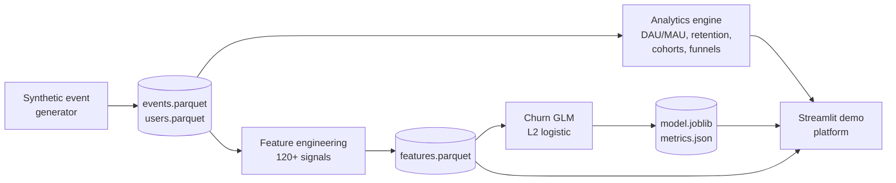

# Product Analytics and User Retention Platform

End-to-end ML platform for churn prediction and product analytics. Generates a
realistic event stream, engineers 120+ user-level features, fits a regularized
logistic GLM, and surfaces every artifact in an interactive dashboard that
tracks DAU/MAU, retention, cohorts, funnels, and at-risk users.

## Highlights

| Metric                         | Value (default run, 8000 users) |
|--------------------------------|---------------------------------|
| Feature count                  | 121                             |
| Test accuracy                  | 86.24%                          |
| Test ROC AUC                   | 0.944                           |
| Test PR AUC                    | 0.925                           |
| Pipeline runtime (end to end)  | ~25 seconds on a laptop         |

Numbers above are reproducible with `python -m src.pipeline --n-users 8000 --regenerate`.

## Architecture



Layered design with a clean separation between data, features, models,
analytics, and presentation. Every layer is independently testable and can be
swapped without touching the others.

```
src/
  data/          synthetic event generator and loaders
  features/      120+ feature engineering pipeline
  models/        GLM training, evaluation, and persistence
  analytics/     DAU/MAU, retention, cohorts, funnels, journeys
  pipeline.py    end-to-end orchestrator (CLI entrypoint)
  config.py      paths, constants, taxonomies
dashboard/
  app.py         multi-page Streamlit demo platform
  theme.py       palette and Plotly defaults
  components.py  reusable UI primitives
tests/           pytest suite covering data, features, model, analytics
```

## Quickstart

Requires Python 3.9 or newer.

```bash
git clone https://github.com/<your-user>/Product-Analytics-and-User-Retention-Platform.git
cd Product-Analytics-and-User-Retention-Platform

python -m venv .venv
source .venv/bin/activate            # Windows: .venv\Scripts\activate
pip install -r requirements.txt

# 1. Generate synthetic data, engineer features, train the GLM
python -m src.pipeline --n-users 8000 --regenerate

# 2. Launch the interactive demo platform
python -m streamlit run dashboard/app.py
```

The dashboard runs at `http://localhost:8501`. If artifacts are missing, the
app shows an in-page bootstrap panel that builds everything on demand.

## Demo platform

A six-page Streamlit application with a custom dark theme, Plotly visuals, and
a sidebar control panel. All pages reuse cached artifacts written by the
training pipeline.

| Page      | What it shows                                                            |
|-----------|--------------------------------------------------------------------------|
| Overview  | Topline KPIs, DAU/WAU/MAU time series, stickiness, plan mix, revenue mix |
| Retention | N-day retention curve, D1/D7/D14/D30 callouts, cohort retention heatmap  |
| Churn     | Model headline metrics, risk distribution, decile lift, calibration plot, top drivers, at-risk worklist |
| Funnels   | Configurable funnel chart, step conversion table, common journey prefixes |
| Cohorts   | Cumulative ARPU by signup cohort, raw cohort table                        |
| Dataset   | Tabbed view of raw events, users, and engineered features                 |

## Feature engineering

Vectorized via `pandas.groupby`. The full set is computed in a single pass over
the observation window for every user.

| Group              | Count | Examples                                                                   |
|--------------------|-------|----------------------------------------------------------------------------|
| Recency            | 8     | `days_since_last_event`, `days_since_last_purchase`, `hours_since_last_event` |
| Frequency (7d)     | 16    | `n_events_w7`, `n_sessions_w7`, `n_purchase_w7`, `max_events_in_day_w7`      |
| Frequency (28d)    | 16    | `n_events_w28`, `unique_features_w28`, `events_per_active_day_w28`          |
| Monetary           | 8     | `total_revenue`, `avg_purchase_value`, `revenue_per_session`                |
| Diversity          | 9     | `unique_event_types`, `event_type_entropy`, `feature_entropy`               |
| Trend / velocity   | 11    | `momentum_index`, `linear_trend_events`, `longest_inactive_streak_w28`      |
| Temporal patterns  | 11    | `share_weekend_events`, `night_owl_score`, `hour_entropy`                   |
| Engagement depth   | 11    | `bounce_rate`, `cart_to_purchase_ratio`, `avg_session_duration_seconds`     |
| Per-feature counts | 10    | `count_feature_dashboard`, `count_feature_api`, ...                         |
| Per-event counts   | 10    | `count_event_purchase`, `count_event_support_ticket`, ...                   |
| Profile            | 11    | `plan_score`, `tenure_days`, `is_paid_plan`, `is_device_mobile`             |

Total: 121 numeric features per user.

## Model

A binomial GLM (logistic link) fitted via statsmodels with an L2 penalty for
stability on a wide feature matrix. Features are standardized after a low
variance filter. The GLM is chosen for explicit, signed coefficients that
behave well as ranking scores and integrate cleanly into review pipelines.

Outputs:
- `artifacts/glm_model.joblib` (trained model with scaler and coefficients)
- `artifacts/metrics.json` (train/test report, lift, calibration metadata)
- `data/processed/features.parquet` (the feature matrix used at training time)

## Analytics

| Module                  | Functions                                                       |
|-------------------------|-----------------------------------------------------------------|
| `analytics.metrics`     | `dau`, `wau`, `mau`, `dau_mau_ratio`, `rolling_active_users`    |
| `analytics.retention`   | `retention_curve`, `nth_day_retention`                          |
| `analytics.cohort`      | `cohort_matrix`, `cohort_revenue`                               |
| `analytics.funnel`      | `funnel_conversion`, `journey_paths`                            |

All functions take the raw event frame plus optional user frame and return
plotting-ready DataFrames.

## Testing

```bash
pytest -q
```

The suite covers:
- Schema invariants on generated data
- Feature count and absence of NaN/Inf
- Label distribution sanity
- Model ranking quality (ROC AUC threshold)
- Funnel monotonicity, retention monotonicity, cohort range checks

## Configuration

`src/config.py` exposes:
- `OBSERVATION_WINDOW_DAYS` (default 56): trailing window for feature aggregation
- `CHURN_HORIZON_DAYS` (default 28): forward window used to derive the label
- `RANDOM_SEED`: reproducibility seed across data, features, and training
- Taxonomies for event types, feature names, plans, channels, devices, countries

## Project layout

```
.
├── README.md
├── requirements.txt
├── setup.py
├── pytest.ini
├── .gitignore
├── .streamlit/config.toml
├── src/
│   ├── config.py
│   ├── pipeline.py
│   ├── data/
│   ├── features/
│   ├── models/
│   └── analytics/
├── dashboard/
│   ├── app.py
│   ├── theme.py
│   └── components.py
├── tests/
├── data/         (generated, gitignored)
└── artifacts/    (generated, gitignored)
```

## License

MIT. See LICENSE for details.
